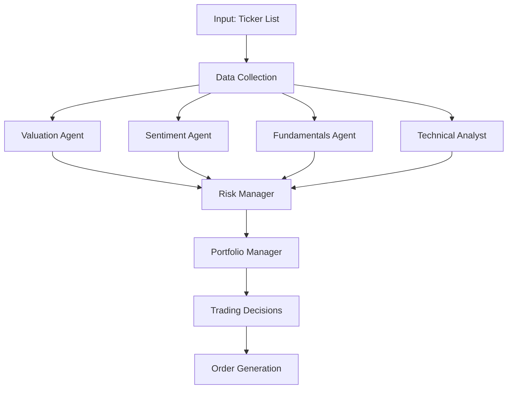

# 🤖 AI-Financial-Orchestrator

<div align="center">


*A sophisticated multi-agent AI system for algorithmic trading and portfolio management*

[🚀 Quick Start](#quick-start) • [📊 Features](#features) • [🏗️ Architecture](#architecture) • [📈 Usage](#usage) • [🔧 Setup](#setup) • [📚 Documentation](#documentation)

</div>

---

## 🎯 Overview

The **AI-Financial-Orchestrator** is an advanced proof-of-concept system that demonstrates the potential of artificial intelligence in financial markets through a sophisticated multi-agent architecture. This research project combines cutting-edge AI technologies with traditional financial analysis to create an intelligent trading system.

### 🎯 Key Objectives

- **Multi-Agent Collaboration**: Six specialized AI agents working in concert to analyze markets
- **Comprehensive Analysis**: Technical, fundamental, sentiment, and valuation analysis
- **Risk Management**: Sophisticated risk assessment and position sizing
- **Backtesting Framework**: Historical performance validation
- **Educational Platform**: Learn about AI applications in quantitative finance

<div align="center">

</div>

---

## 🚀 Quick Start

```bash
# Clone the repository
git clone https://github.com/Harikrushna2272/AI-Financial-Orchestrator.git
cd ai-hedge-fund

# Install dependencies
poetry install

# Set up environment variables
cp .env.example .env
# Edit .env with your API keys

# Run the hedge fund
poetry run python src/main.py --ticker AAPL,MSFT,NVDA

# Run backtesting
poetry run python src/backtester.py --ticker AAPL,MSFT,NVDA
```

---

## 📊 Features

### 🧠 Multi-Agent Intelligence System

| Agent | Specialization | Capabilities |
|-------|---------------|--------------|
| **Valuation Agent** | Intrinsic Value Analysis | DCF modeling, P/E analysis, growth projections |
| **Sentiment Agent** | Market Sentiment | News analysis, social media sentiment, market mood |
| **Fundamentals Agent** | Financial Metrics | Balance sheet analysis, cash flow, profitability ratios |
| **Technical Analyst** | Chart Patterns | Moving averages, RSI, MACD, support/resistance |
| **Risk Manager** | Risk Assessment | VaR calculation, position limits, portfolio optimization |
| **Portfolio Manager** | Decision Orchestration | Signal aggregation, order generation, execution |

### 🔬 Advanced Capabilities

- **Real-time Data Integration**: Live market data and financial metrics
- **Dynamic Portfolio Management**: Automated rebalancing and position sizing
- **Comprehensive Backtesting**: Historical performance analysis with detailed metrics
- **Risk-Aware Trading**: Sophisticated risk management and position limits
- **Multi-Timeframe Analysis**: Short-term and long-term market perspectives
- **Customizable Workflows**: Selective agent activation and parameter tuning

### 📈 Performance Analytics

- **Sharpe Ratio**: Risk-adjusted return measurement
- **Maximum Drawdown**: Worst-case scenario analysis
- **Win Rate**: Percentage of profitable trades
- **Profit Factor**: Ratio of gross profit to gross loss
- **Calmar Ratio**: Annual return to maximum drawdown ratio

---

## 🏗️ Architecture

### System Design

The AI Hedge Fund employs a sophisticated **StateGraph** architecture using LangGraph, enabling complex multi-agent workflows with state management and conditional routing.



### Agent Communication Flow

1. **Data Ingestion**: Market data, financial statements, and sentiment indicators
2. **Parallel Analysis**: Agents process data simultaneously for efficiency
3. **Signal Generation**: Each agent produces trading signals with confidence scores
4. **Risk Assessment**: Risk manager evaluates portfolio impact and position limits
5. **Decision Aggregation**: Portfolio manager combines signals into final decisions
6. **Execution Planning**: Order generation with position sizing and timing

### Technology Stack

- **AI Framework**: LangChain + LangGraph for agent orchestration
- **Language Model**: OpenAI GPT-4o for natural language reasoning
- **Data Processing**: Pandas + NumPy for financial calculations
- **Visualization**: Matplotlib for performance charts
- **CLI Interface**: Rich + Questionary for interactive experience
- **Dependency Management**: Poetry for reproducible environments

---

## 📈 Usage

### Basic Trading Simulation

```bash
# Analyze single stock
poetry run python src/main.py --ticker AAPL

# Multi-stock portfolio analysis
poetry run python src/main.py --ticker AAPL,MSFT,NVDA,GOOGL,TSLA

# With detailed reasoning output
poetry run python src/main.py --ticker AAPL --show-reasoning

# Custom date range analysis
poetry run python src/main.py --ticker AAPL,MSFT --start-date 2024-01-01 --end-date 2024-03-01
```

### Advanced Backtesting

```bash
# Comprehensive backtest with performance metrics
poetry run python src/backtester.py --ticker AAPL,MSFT,NVDA

# Custom backtest period
poetry run python src/backtester.py --ticker AAPL,MSFT,NVDA --start-date 2024-01-01 --end-date 2024-06-30

# Interactive backtest with custom parameters
poetry run python src/backtester.py
```

### Example Output

<div align="center">

</div>

<div align="center">

</div>

---

## 🔧 Setup

### Prerequisites

- **Python 3.9+**: Modern Python with type hints support
- **Poetry**: Dependency management and virtual environments
- **API Keys**: OpenAI API key (required), Financial Datasets API key (optional)

### Installation

1. **Clone Repository**
   ```bash
   git clone https://github.com/Harikrushna2272/AI-Financial-Orchestrator.git
   cd AI-Financial-Orchestrator
   ```

2. **Install Poetry** (if not installed)
   ```bash
   curl -sSL https://install.python-poetry.org | python3 -
   ```

3. **Install Dependencies**
   ```bash
   poetry install
   ```

4. **Environment Configuration**
   ```bash
   cp .env.example .env
   ```

   Configure your `.env` file:
   ```env
   # Required: OpenAI API key for AI reasoning
   OPENAI_API_KEY=your-openai-api-key-here
   
   # Optional: Financial Datasets API for extended data
   FINANCIAL_DATASETS_API_KEY=your-financial-datasets-api-key-here
   ```

### API Key Setup

- **OpenAI API**: Required for all AI agent reasoning
  - Get your key at [OpenAI Platform](https://platform.openai.com/)
  - Free tier available for testing

- **Financial Datasets API**: Optional for extended ticker support
  - Free data available for: AAPL, GOOGL, MSFT, NVDA, TSLA
  - Premium data for additional tickers

---

## 📚 Documentation

### Project Structure

```
ai-hedge-fund/
├── src/
│   ├── agents/                   # AI Agent Implementations
│   │   ├── fundamentals.py       # Fundamental analysis & financial metrics
│   │   ├── portfolio_manager.py  # Portfolio optimization & decision making
│   │   ├── risk_manager.py       # Risk assessment & position limits
│   │   ├── sentiment.py          # Market sentiment analysis
│   │   ├── technicals.py         # Technical indicators & chart patterns
│   │   └── valuation.py          # Intrinsic value & DCF modeling
│   ├── data/                     # Data Models & Caching
│   │   ├── cache.py              # Data caching mechanisms
│   │   └── models.py             # Data structures & schemas
│   ├── graph/                    # Workflow Orchestration
│   │   └── state.py              # State management & data flow
│   ├── tools/                    # External Integrations
│   │   └── api.py                # Financial data APIs
│   ├── utils/                    # Utility Functions
│   │   ├── analysts.py           # Agent coordination logic
│   │   ├── display.py            # Output formatting & visualization
│   │   └── progress.py           # Progress tracking & user feedback
│   ├── backtester.py             # Historical performance testing
│   └── main.py                   # Application entry point
├── pyproject.toml                # Project configuration & dependencies
├── poetry.lock                   # Locked dependency versions
└── README.md                     # Project documentation
```

### Agent Details

#### Valuation Agent (`valuation.py`)
- **Purpose**: Calculate intrinsic stock values using multiple methodologies
- **Methods**: Discounted Cash Flow (DCF), P/E ratio analysis, growth projections
- **Output**: Buy/sell signals based on value vs. price discrepancies

#### Sentiment Agent (`sentiment.py`)
- **Purpose**: Analyze market sentiment and emotional indicators
- **Sources**: News sentiment, social media trends, market mood indicators
- **Output**: Sentiment-based trading signals with confidence scores

#### Fundamentals Agent (`fundamentals.py`)
- **Purpose**: Analyze company financial health and performance
- **Metrics**: Revenue growth, profitability ratios, debt levels, cash flow
- **Output**: Fundamental strength assessments and trading recommendations

#### Technical Analyst (`technicals.py`)
- **Purpose**: Identify chart patterns and technical indicators
- **Indicators**: Moving averages, RSI, MACD, Bollinger Bands, support/resistance
- **Output**: Technical buy/sell signals with trend analysis

#### Risk Manager (`risk_manager.py`)
- **Purpose**: Assess portfolio risk and set position limits
- **Metrics**: Value at Risk (VaR), maximum drawdown, correlation analysis
- **Output**: Position sizing recommendations and risk warnings

#### Portfolio Manager (`portfolio_manager.py`)
- **Purpose**: Orchestrate final trading decisions and order generation
- **Process**: Signal aggregation, conflict resolution, execution planning
- **Output**: Final trading decisions with position sizes and timing

### Configuration Options

#### Command Line Arguments

| Argument | Description | Default | Example |
|----------|-------------|---------|---------|
| `--ticker` | Stock symbols to analyze | None | `AAPL,MSFT,NVDA` |
| `--start-date` | Analysis start date | 1 year ago | `2024-01-01` |
| `--end-date` | Analysis end date | Today | `2024-06-30` |
| `--show-reasoning` | Display agent reasoning | False | `--show-reasoning` |

#### Environment Variables

| Variable | Description | Required | Default |
|----------|-------------|----------|---------|
| `OPENAI_API_KEY` | OpenAI API key for AI reasoning | Yes | None |
| `FINANCIAL_DATASETS_API_KEY` | Financial data API key | No | None |

---

## ⚠️ Important Disclaimers

### Educational Purpose Only

This project is designed **exclusively for educational and research purposes**. It demonstrates AI applications in finance but is **not intended for real trading or investment decisions**.

### Key Limitations

- **No Real Trading**: System simulates decisions only, no actual market orders
- **Historical Data**: Analysis based on past data, not predictive guarantees
- **Model Limitations**: AI models have inherent limitations and biases
- **Market Complexity**: Real markets involve factors beyond AI analysis scope

### Risk Warnings

- **No Financial Advice**: This software does not constitute investment advice
- **No Guarantees**: Past performance does not indicate future results
- **No Liability**: Creators assume no responsibility for financial losses
- **Professional Consultation**: Always consult qualified financial advisors

### Responsible Usage

By using this software, you acknowledge and agree to:
- Use solely for educational and research purposes
- Not rely on outputs for actual investment decisions
- Understand the experimental nature of AI trading systems
- Accept all risks associated with financial market analysis

---

## 🤝 Contributing

We welcome contributions from researchers, developers, and financial professionals interested in AI applications in finance.

### Contribution Guidelines

1. **Fork the Repository**
   ```bash
   git clone https://github.com/Harikrushna2272/AI-Financial-Orchestrator.git
   ```

2. **Create Feature Branch**
   ```bash
   git checkout -b feature/your-feature-name
   ```

3. **Development Setup**
   ```bash
   poetry install
   poetry run pre-commit install
   ```

4. **Code Quality**
   - Follow PEP 8 style guidelines
   - Add comprehensive tests for new features
   - Update documentation for API changes
   - Ensure all tests pass before submitting

5. **Submit Pull Request**
   - Keep PRs focused and well-documented
   - Include clear description of changes
   - Reference related issues when applicable

### Development Tools

- **Code Formatting**: Black for consistent code style
- **Import Sorting**: isort for organized imports
- **Linting**: flake8 for code quality checks
- **Testing**: pytest for comprehensive test coverage

---

## 🙏 Acknowledgments

- **OpenAI**: For providing the GPT-4 language model
- **LangChain**: For the agent framework and tools
- **Financial Datasets**: For market data and financial metrics
- **Open Source Community**: For the underlying libraries and tools

---

## Reference : 

- **help**: [GitHub Discussions](https://github.com/virattt/ai-hedge-fund)

---

<div align="center">

**Built with ❤️ for the AI and Finance communities**

*This project demonstrates the intersection of artificial intelligence and quantitative finance, serving as a platform for research and education in algorithmic trading.*

</div>
